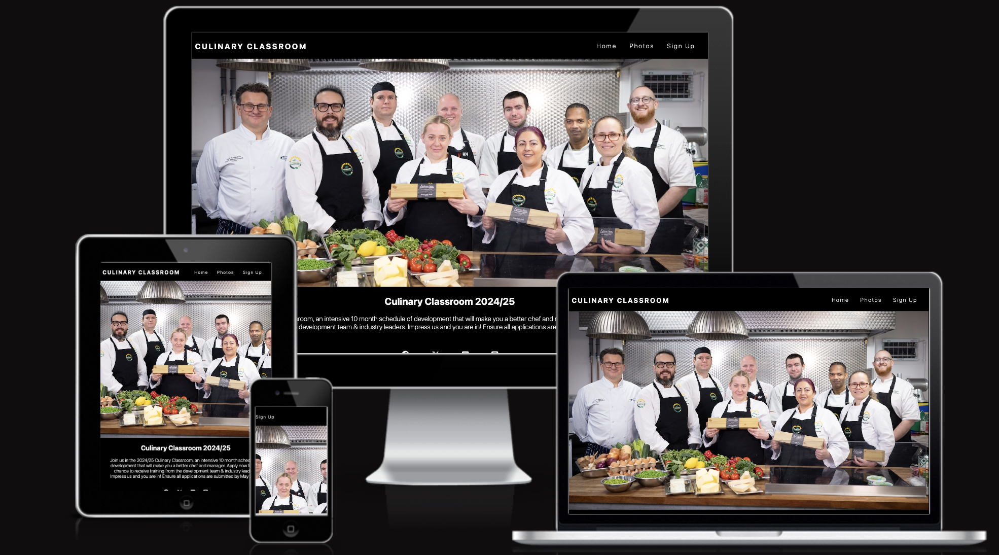
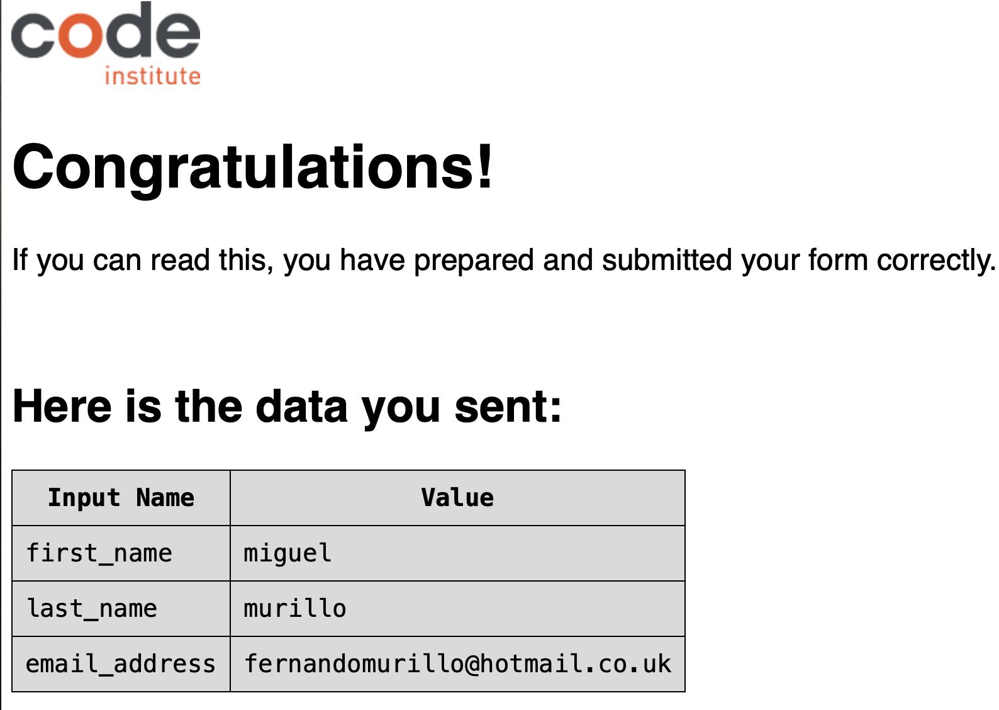
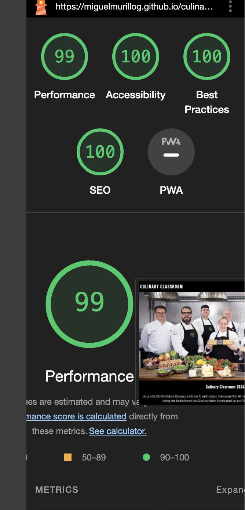
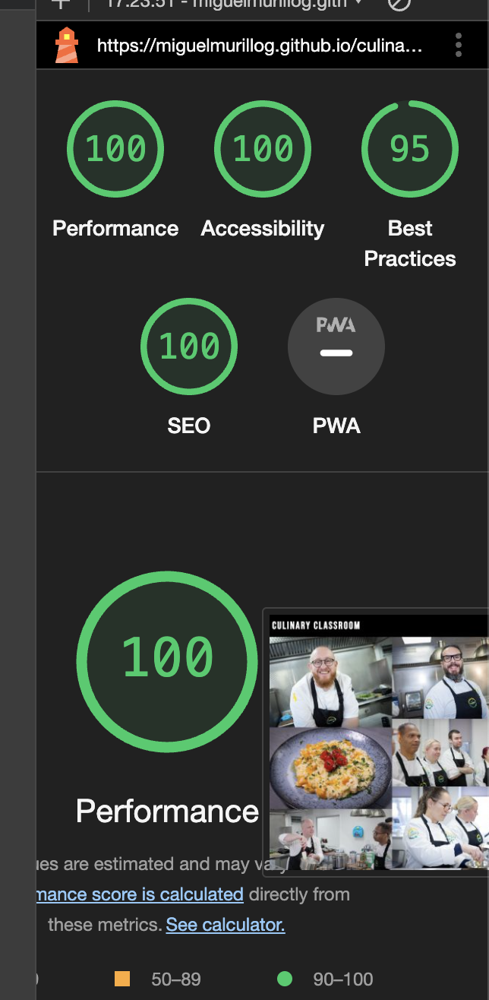
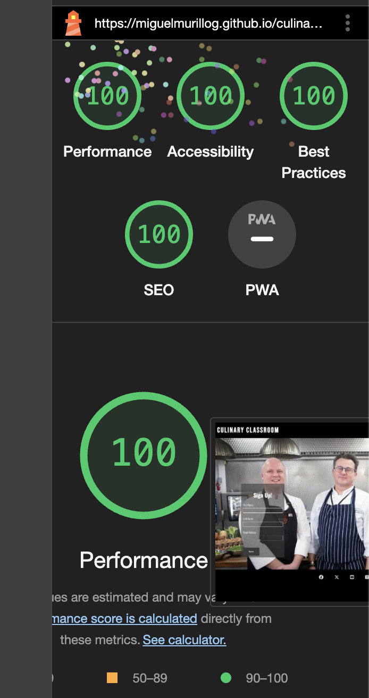
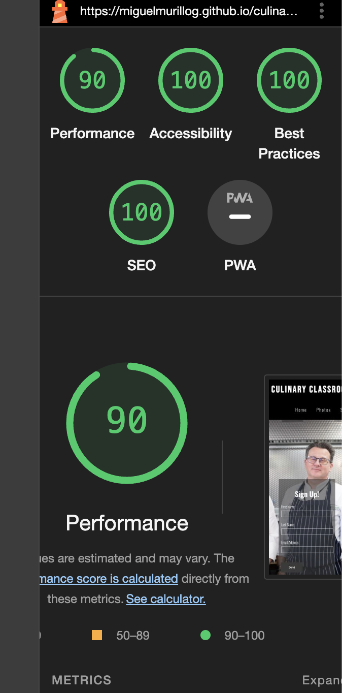

# Portfolio Project 1 - Culinary Classroom

The Culinary Classroom Website is designed to promote a course that I been working as a chef for the last 10 months. The goal in this project is to prove my knowledge that I been practicsing during my course in HTML and CSS.

---

## Live Site

[Culinary-Classroom] (https://miguelmurillog.github.io/culinary-classroom/index.html)

---
# Features

My project consists of three webpages:

- Home page
- Photo page
- Sign up page.

### - The Navigation Bar

- A responsive navigation bar facilitates easy access to different sections of the website, including Home, Photos and  Sign up.

### - The Home Page

- Home page, displays the main image of the culinary clasroom team, this is located on the top of the website. it aims to give the user a first time view experience 
- The user will find short description of the course and also details for when has to be enrolled . This section is also supported by the footer social media links.

### - The Photos Page

- Gallery page, highlights various images of the artist work, some of them are sketches and some are personal projects for use of his portfolio.

### - The Sign up Page

- Contact page, encourages the users to send their details to enrol into the program
- The sign up form collects details of the user such as name, last namel and email adress.

- I tested the sign up form with a succesful result.

### - The Footer

- The footer section includes links to social medias.

## Testing
---

- I tested this page in different web browsers such as: Chrome, Firefox, Safari on desktop and mobile phones respectively.
- I confirmed that this project is responsive, looks good and functions on all standard screen sizes using the DevTools device toolbar.
- I confirmed that the navigation, header, home, profile, gallery, and contact text are all readable and easy to understand.
- I confirmed that the form works. It requires entries in every field (excluding the message), will only accept an email in the email field, and the submit button works.

### Google Chrome Browser

### Safari Browser

### Firefox Browser

## Bugs

### Solved bugs

- While testing the navegation menu before deploying my project to github, I noticed there was a problem when clicking on the profile menu from the contact one; instead of taking me to the correct destination, it took me to the home page instead.
- I discovered this was due when I copied the initial index.html file to the contact one, I forgot to update the href to "profile.html" within the anchor element.

- The pictures in the website the resolution was too high  and affected the score for performance in lighthouse for this section of the website, I fixed this by converting the file reducing the size.

### Unfixed Bugs

- No unfixed bugs.

## Validator Testing

### HTML

- No errors were returned when passing through the officia W3C

### CSS

- No errors were found when passing through the official (Jigsaw) validator.

### Accessibility

- I confirmed that the colors and fonts chosen are easy to read and accessible by running lighthouse in DevTools.

### Desktop

### Mobile

### Deployment

The site was deployed to GitHub pages. The steps to deploy are:

- In the GitHub repository, navigate to the Settings tab.
- On the GitHub Pages section clicked on the pages settings dedicated tab link.
- From the source section drop-down menu, select the Main Branch click on seve.
- Once the Main Branch has been selected and saved, the page provided the link to the completed website.

The live link ca be found here: [Culinary-Classroom](https://miguelmurillog.github.io/culinary-classroom/index.html)

----
# Credits

## Content

- The idea for this project was based in the challenge of Love Running project. I don't have any previous experience in coding it was challenging. 
- The icons in for the footer were taken from [Font Awesome](https://fontawesome.com/)

## Media

- All images in my website was taken from my Culinary Classrrom course last year.

## Acknowledgements

- The README template provided y Code Institute on the sample project README.md from "Project Portfolio 1"
- The online tutors for all their help.
- The Code Institute slack community.
- Online tutorials about HTML and CSS.
- Code institite support, was really helpul through this challenge.
