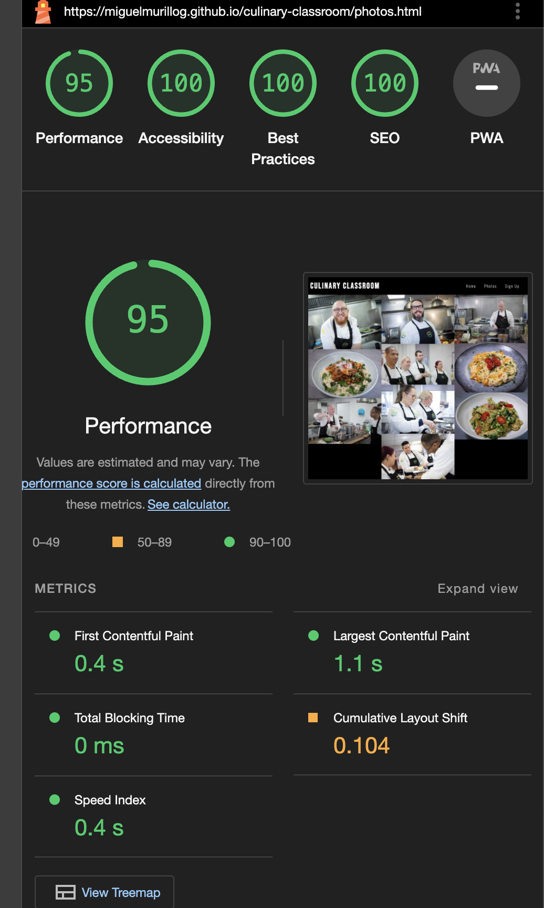

# Portfolio Project 1 - Culinary Classroom

The Culinary Classroom Website serves as a platform to promote a culinary course developed based over a 10 months period. This project aims to showcase the skills and knowledge acquired throughout the course of my studies in HTML and CSS. 

---

## Live Site

[Culinary-Classroom] (https://miguelmurillog.github.io/culinary-classroom)

---
# Features

My project consists of three webpages:[text](https://chat.openai.com/c/e01568c9-add5-4274-9410-554186b04a00)

- Home page
- Photos page
- Sign up page.

### - The Navigation Bar

- A responsive navigation bar facilitates easy access to different sections of the website, including Home, Photos and  Sign up.

### - The Home Page

- Home page, displays the main image of the culinary clasroom team, this is located on the top of the website. it aims to give the user a first time view experience 
- The user will find short description of the course and also details for when has to be enrolled . This section is also supported by the footer social media links.

### - The Photos Page

- Gallery page, highlights various images of the artist work, some of them are sketches and some are personal projects for use of his portfolio.

### - The Sign up Page

- Contact page, encourages the users to send their details to enrol into the program
- The sign up form collects details of the user such as name, last namel and email adress.

- I tested the sign up form with a succesful result.

### - The Footer

- The footer section includes links to social medias.

## Testing
---

- I tested this page in different web browsers such as: Chrome, Firefox, Safari on desktop and mobile phones respectively.
- I confirmed that this project is responsive, looks good and functions on all standard screen sizes using the DevTools    device toolbar.
- I confirmed that the navigation, header, home, photos  and sign up form are all readable and easy to understand for the user.
- I confirmed that the form works. It requires entries in every field (excluding the message), will only accept an email in the email field, and the submit button works.

### Google Chrome Browser

### Safari Browser

### Firefox Browser

## Bugs

### Solved bugs

- During the development process, I encountered an issue with integrating Google Fonts into the project within Visual Studio Code. Despite implementing the appropriate syntax, the fonts failed to render correctly. Upon troubleshooting, I discovered that enclosing the font names within quotation marks resolved the issue. This adjustment ensured proper integration of Google Fonts, allowing for consistent and appealing typography throughout the website.

- One challenge encountered during development was related to the resolution of images used on the website. The high resolution of these images negatively impacted the performance score in Lighthouse tests. To address this issue, I resized and optimized the images, reducing their file size without compromising on quality. This optimization resulted in improved website performance, ensuring faster loading times and a better user experience overall.

### Unfixed Bugs

- No unfixed bugs.

## Validator Testing

### HTML

- No errors were returned when passing through the officia W3C

### CSS

- No errors were found when passing through the official (Jigsaw) validator.

### Accessibility

- I confirmed that the colors and fonts chosen are easy to read and accessible by running lighthouse in DevTools.

### Desktop

### Mobile

### Deployment

The site was deployed to GitHub pages. The steps to deploy are:

- In the GitHub repository, navigate to the Settings tab.
- On the GitHub Pages section clicked on the pages settings dedicated tab link.
- From the source section drop-down menu, select the Main Branch click on seve.
- Once the Main Branch has been selected and saved, the page provided the link to the completed website.

The live link ca be found here: [Culinary-Classroom](https://miguelmurillog.github.io/culinary-classroom)

----
# Credits

## Content

- The Culinary Classroom Website is inspired by the challenge presented in the Love Running project. As someone new to coding without prior experience, embarking on this project was both challenging and immensely rewarding. It served as a significant milestone in my coding journey, allowing me to apply newfound knowledge and skills in a practical context. Through this project, I aimed to create a user-friendly platform for culinary education, leveraging the principles and techniques learned during the Love Running challenge.

- The icons in for the footer were taken from [Font Awesome](https://fontawesome.com/)

## Media

- All images in my website was taken from my Culinary Classrrom course last year.

## Acknowledgements

- The README template provided by Code Institute on the sample project README.md from "Project Portfolio 1"
- The Code Institute slack community.
- Online tutorials about HTML and CSS.
- Special thanks to Code Institute and my mentor Sheryl for guidance and support throughout the development process.
